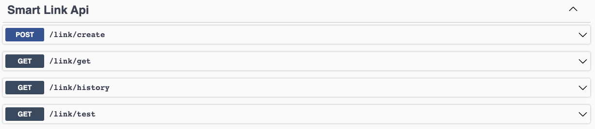
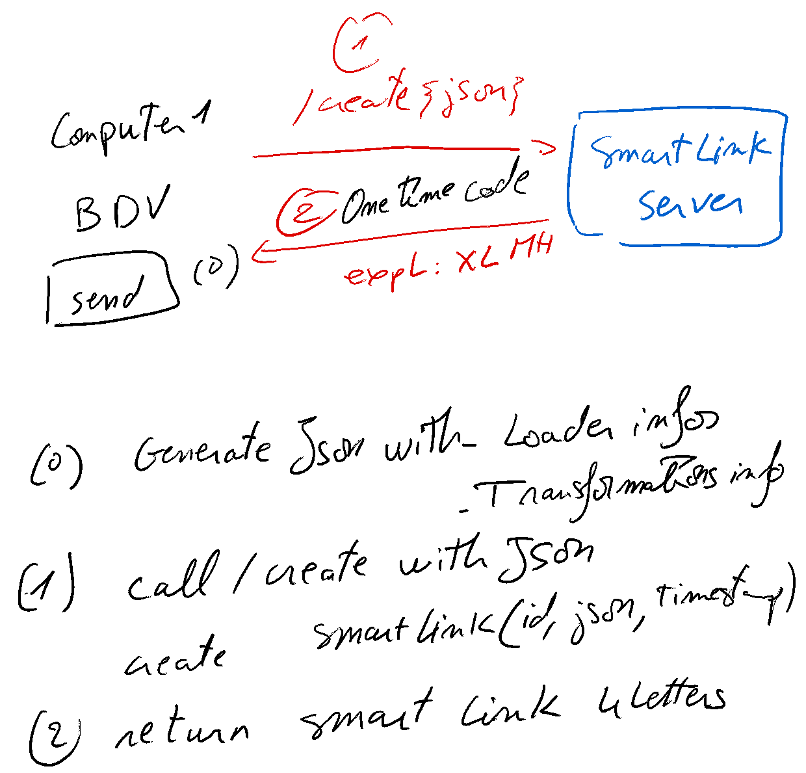
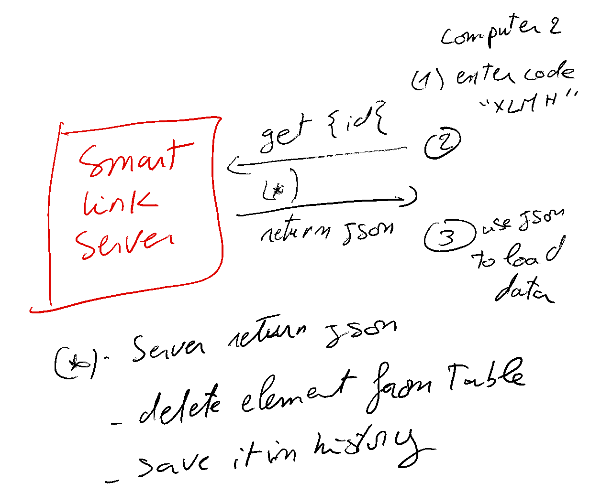

# Big Data Viewer Onetime Link 

## Goal:
Being able to load same data with the same view in another computer or embedded device using simple one time code. 

Example: XLMH
---
### REST APIs:

---
### Workflow:
#### 1- Create

#### 2-Get

---

I used quarkus, Docker and Swagger-UI